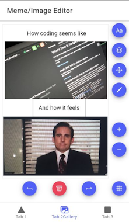

# Coffee Goat Department
[](https://github.com/Reterics/coffee-goat-department/actions/workflows/build.yml)

Ionic + React based Image and Meme Editor Project.

 

## Install

For the latest stable version

```bash
npm install -g @ionic/cli
npm install
npm run start
```

## Test on Android

```bash
npm run update_android
npm run build_apk
```

## Contribute

There are many ways to [contribute](https://github.com/Reterics/coffee-goat-department/blob/main/CONTRIBUTING.md) to Coffee Goat Department.
* [Submit bugs](https://github.com/Reterics/coffee-goat-department/issues) and help us verify fixes as they are checked in.
* Review the [source code changes](https://github.com/Reterics/coffee-goat-department/pulls).
* [Contribute bug fixes](hhttps://github.com/Reterics/coffee-goat-department/blob/main/CONTRIBUTING.md).

